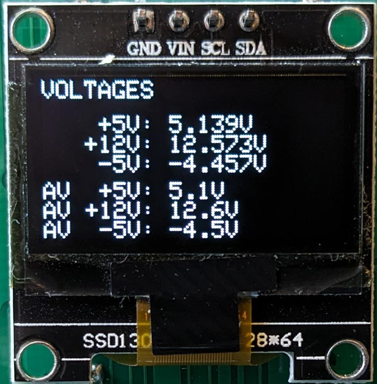
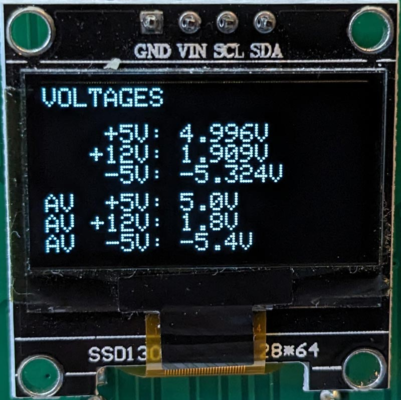
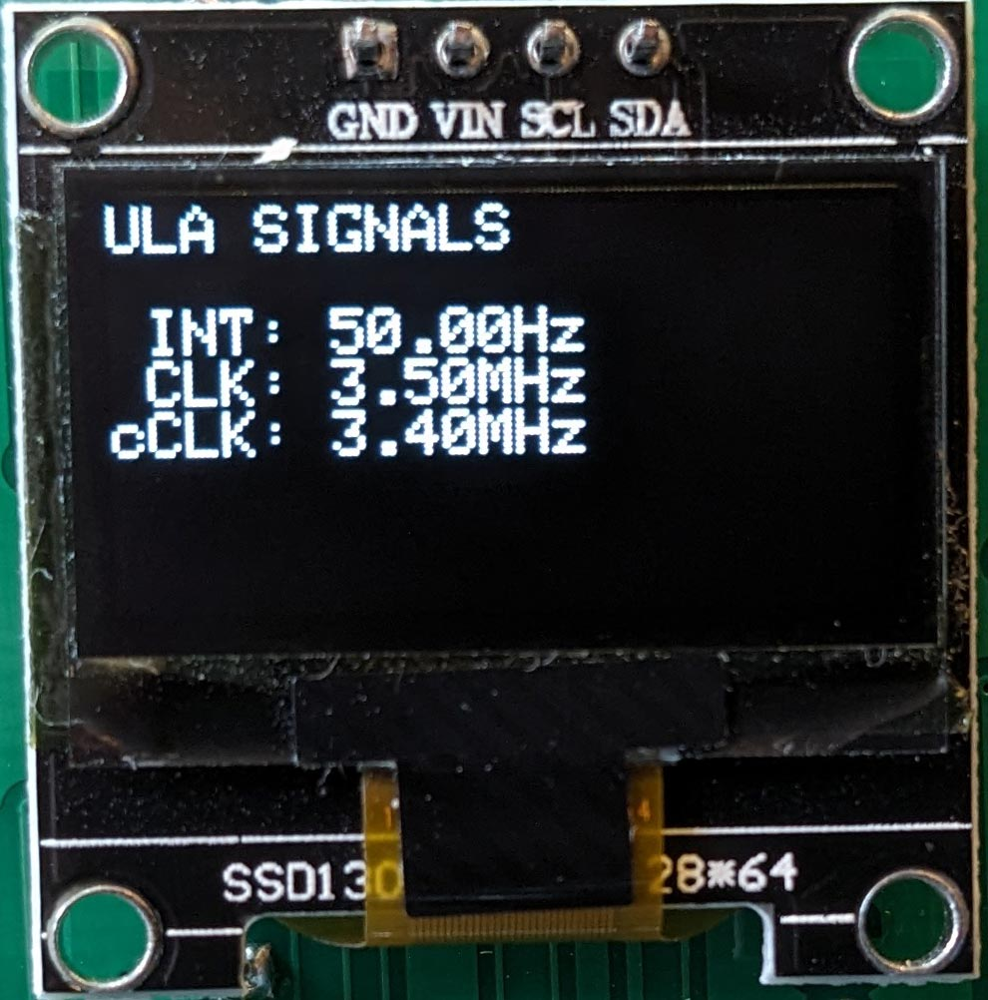

# 16K/48K ZX Spectrum Diagnostics Board

This is a hardware diagnostics board for the 16K and 48K ZX Spectrum,
based on two Raspberry Pi Pico microcontroller boards.

The idea is that given a Spectrum of unknown provenance (an eBay
purchase maybe), this device can quickly tell you what potential
issues the Spectrum might have. It's limited to what it can see on the
rear edge connector, so it can't detect broken tracks or things like
that, but it can report a fair amount of useful information. There are
no guarantees, of course.

The board plugs into the Spectrum's rear edge connector, and has an OLED
screen and a single user-interface button:

The rear of the board carries the Picos and some header sockets (discussed below):

The board is powered by the Spectrum. You just plug it in and turn the
Spectrum on. It will (repeatedly) run a set of tests on the signals it
sees on the rear edge connector. The tests are divided into pages. Pressing
the button advances to the next page of tests.

## Status

As of March 2024, v1.2 is functionally complete. The KiCAD project here is current up
to v1.3 which just has a couple of silkscreen fixes.

There is plenty of scope to upgrade the tests the board runs, so updates
might appear in future. For now the board is complete.

[Derek Fountain](https://www.derekfountain.org/), March 2024

# Operation

The Spectrum is usable when the device is displaying the voltages page.
The tests which run on the other pages constantly reset the Spectrum
so it can't be used when any of those are showing.

The pages, and the tests run, are as follows. You might find it useful to
read the [Spectrum Service manual](https://spectrumforeveryone.com/wp-content/uploads/2017/08/ZX-Spectrum-Service-Manual.pdf)
in conjuction with the following.

## Voltages Page

Voltages are the first thing we look at when faced with a broken ZX Spectrum.
There are four voltages used: the input from the PSU, which is nomimally +9V
and isn't analysed by the Picos; the main +5V supply for the Spectrum board;
the +12V supply for the RAM and video subsystem; and the -5V supply for the
RAM.

The OLED screen shows the voltages on the rear edge connector.
That's not the same as what's going on at the RAM chips! But it's a very good
indication, especially when you see faults being reported.

The top three lines of the display show the voltages as detected by the Pico's
analog to digital converters. These values update several times a second. The
bottom three lines show the averages for those values over the last 100
samples. Note that the further the voltages get from the expected values, the
less accurate the reported values will be. This is because the circuitry on the
board is designed to protect the Picos from rogue voltages, as opposed to
providing accurate results in all circumstances.

The Picos are powered from the Spectrum's +5V so if that's not working
the Picos won't turn on and you probably won't have got this
far. Assuming the plug on the PSU is outputing 9V to 14V as you'd
expect, you probably have a faulty 7805 regulator.

The +12V and -5V supplies come from the Spectrum's internal DC/DC
converters. They're known to be a bit wobbly, and the -5V supply in particular
has a rather wide tolerance (-5.5V to -4.0V, see the service manual).

Here's a screen showing the voltages from a broken Spectrum. The -5V supply is
within specification, but the 12V supply is broken:

Note: if the Spectrum's internal voltage regulator has failed in such
a way that the Spectrum's internal +5V supply is too high, that high
voltage will be fed into the Picos and might destroy them. The maximum
they can take is +5.5V. I've never heard of a 7805 regulator failing
in this way, and if one does the Spectrum it's inside will be very
dead, but if you think it might have happened you should check the +5V
on the edge connector before connecting the Picos to it. (Remove the
Picos, plug the board in to the Spectrum, then check the +5V line at
any of the +5V sample points.)

## ULA Page

The ULA does a lot of stuff inside the Spectrum, and can fail in whole
or in part. i.e. some parts of its internal circuitry can be working while other
parts are dead. A partially working ULA can be rather puzzling to
diagnose. The tests on the diagnostics board only test the clocks the
ULA is emitting.

The INT clock is the Spectrum's interrupt clock. It's used to generate
both the TV picture and the Z80's interrupt signal. What's sampled
from the edge connector is directly from the ULA and should be exactly
50Hz.

The CLK is the Z80's clock, which is also generated by the ULA. This should be
3.5MHz. The diagnostics board samples the signal using the RP2040's PIOs, and
is (interally) accurate to a single clock cycle. This is sampled with the Z80
held in reset, so the Spectrum's notorious memory contention doesn't get in
the way (see next item).

The cCLK is the contended clock, which is the clock signal the ULA provides for
the Z80 when the ULA and memory chips clash trying to read lower memory. This will
always be slightly slower than the CLK signal. This is sampled when the Z80 is
allowed to run normally, which means the ROM code is running and is updating
the screen and system variables which are in lower RAM. Some contention should
always be reported. Holding the space key down while the test is running
changes the contention pattern:

## Z80 Page

A subset of the Z80 signals are exposed on the Spectrum's rear edge connector:
read, write, memory read, and I/O request. Their exact behaviour aren't analysed (but
could be).

The Spectrum is allowed to start normally, then the Z80 signals are checked to ensure
they are transiting from low to high state, and from high to low state. Any
stuck signal will be reported, and would explain a failure of the Spectrum. Look for
solder bridges from botched repairs, or broken tracks.

The M1 line is an exception. Sinclair used some Z80s with non-functioning M1 signals,
and machines with those faulty Z80s can't drive certain peripherals like the Interface
One and my [recreated ZX Spectrum Expansion System](https://www.derekfountain.org/zses.php). The Spectrum can otherwise function
correctly, so a fault reported with the M1 line isn't that unusual and doesn't indicate
a fault which would stop the machine working.

## Data Bus Page

This test allows the Spectrum to start normally, then the Z80 data bus signals are
checked to ensure they are transiting from low to high state, and from high to low
state. Any stuck signal will be reported, and would explain a failure of the Spectrum.
The most likely cause would be a faulty memory chip holding its output bit high or
low, but also look for solder bridges from botched repairs, or broken tracks.

If the Spectrum has a faulty ROM or some other unusual fault it would still be likely
that whatever was appearing on the data bus would consist of state changes of all the
lines, at least occasionally. Therefore this test should be able to indicate stuck
lines reasonably reliably even in the presence of other faults.

## Address Bus Page

This test allows the Spectrum to start normally, then the Z80 address bus signals are
checked to ensure they are transiting from low to high state, and from high to low
state. Any stuck signal will be reported, and would explain a failure of the Spectrum.

The early code in the Spectrum's ROM does a RAM check which writes and reads from the
whole 64K address space, so all the address lines should transit within a second or so
of the machine starting up.

The ULA's signals on the address bus aren't exposed on the edge connector. What is
reported here is the Z80's perspective.

## ROM Page

This page runs a single test which checks whether the ROM appears to be providing
the correct data to the Z80 (i.e. the program which implements the Spectrum's BASIC
interpreter).

It allows the Spectrum to start, then samples the address bus watching for reads of
bytes from the ROM. Those addresses are collected, then analysed to see if they follow
the expected pattern. The Z80 code at the start of the Spectrum's ROM disables
interrupts, primes a couple of registers, then jumps to an absolute (hardcoded)
location. It's therefore possible to check whether the Z80 is requesting the bytes at
0x0000 to 0x0007 one at a time in sequence, then requests the byte at 0x11CB (which is
where the jump goes to) and so on.

It only samples a couple of dozen addresses to check the Z80 is following the expected
sequence, but if it is that means the Z80, and its control, data and address buses
are all functioning correctly or very close to correctly.

# ZX Signal Headers

The board has 3 rows of 20 pins which make accessible the Z80 and
Spectrum control signals which are on the rear edge connector, plus a
few more from the board itself.  They're labelled J201, J202 and
J203. All except one (~12V) of the Spectrum's edge connector signals
are brought out to these connectors (and that missing ~12V line could
now be fixed because after a juggle around I found a couple of spare
connections - see the errata.txt file).

These headers allow jumper wires to be inserted which enable easy
connection to a meter or oscilloscope. I've found this very
handy. This photo shows oscilloscope probing of the Z80 clock and
another signal from a board I got from eBay. Note the silver tab on
the corner of the board is a ground point for attaching clips to.

# Bill of Materials

This is a simple build. You will need:

3x [3216 SMD Diode](https://www.mouser.co.uk/ProductDetail/581-SD1206S040S2R0)
Schottky Diode for Pico input protection and 12V clamping
 
1x [PMBT2222A SMD Transistor](https://www.mouser.co.uk/ProductDetail/771-PMBT2222A-T-R)
NPN Transistor for /RESET
 
1x [3216 SMD 1K Resistor](https://www.mouser.co.uk/ProductDetail/603-RT1206FRE071KL)
1K Resistor for /RESET
 
3x [3216 SMD 1K5R Resistor](https://www.mouser.co.uk/ProductDetail/603-RT1206FRE071K5L)
1K5 Resistor for the voltage dividers
 
1x [3216 SMD 390R Resistor](https://www.mouser.co.uk/ProductDetail/603-RT1206FRE07390RL)
390R Resistor for the voltage divider
 
1x [3216 SMD 5K6 Resistor](https://www.mouser.co.uk/ProductDetail/603-RT1206FRE075K6L)
5K6 Resistor for the voltage divider
 

Also, from your parts bin:

2x Raspberry Pi Pico with pins and sockets if you want them
 
1x 4-pin header and socket for mounting the screen
 
1x SPST switch. Any single pole, single throw switch should do for the user input
 
1x 0.96" OLED display (SSH1106 based if you want to use my code)

Note that the OLED screen I used is SSH1106 based. It's actually got SSD1306
printed on it, which was an unpleasant surprise at the time. If you want to
use one of the more common SSD1306 based screens the software will need
updating. It's only displaying text so that shouldn't be too difficult.